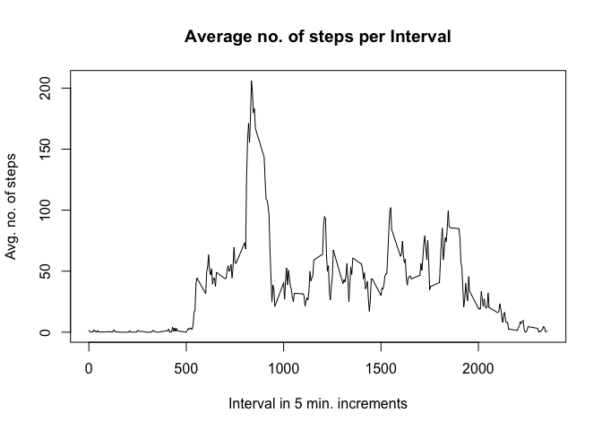

# Reproducible Research: Peer Assessment 1

## Loading and preprocessing the data

```r
data <- read.csv(filePath, header = TRUE)
```

## What is mean total number of steps taken per day?

```r
# Get only the non-NA data
validData <- subset(data, !is.na(steps))
dailySteps <- tapply(validData$steps, validData$date, sum, na.rm = TRUE)
hist(dailySteps, col = "blue", xlab = "No. of steps", ylab = "Date", main = "Histogram of the no. of steps walked in a month")
```

<!-- -->

```r
meanSteps <- mean(as.vector(dailySteps), na.rm = TRUE)
medianSteps <- median(as.vector(dailySteps), na.rm = TRUE)
```
On an **average**, the user walked **10766.19 ** steps everyday in the measurement period, with a **median**  **10765** steps per day

## What is the average daily activity pattern?

```r
avgStepsByInt <- aggregate(steps ~ interval, validData, mean)
plot(avgStepsByInt$interval, avgStepsByInt$steps, type = "l", xlab = "Interval in 5 min. increments", ylab = "Avg. no. of steps", main = "Average no. of steps per Interval")
```

<!-- -->

```r
# Calculate the the interval that, on average across all days, has the max. number of steps. 
intWithMaxSteps <- which.max(avgStepsByInt$steps)
maxAvgStepsInInt <- avgStepsByInt[intWithMaxSteps, "steps"]
```
The **104th** interval has the maximum of average steps across all the days in the given sample set. On an average, the user has taken **206.17** steps during this measurement interval. 

## Imputing missing values

```r
# Calculte the number of rows that do not have a valid steps count for our calculation. 
naRows <- which(is.na(data$steps))
# Now that we have the indices of the rows that do not have a valid Step Count, let us fill these values 
# with the average of the 5-min interval across all readings. 
# Remember we have the average step count for each 5-min interval calculated above. 

# Get the cells that hold the interval value for the rows that have steps = NA
naRowsIntCols <- data[naRows, "interval"]

# Now create a DF with these rows set to the average no. of steps for that interval
setStepValueForInt <- function(x) {
  return(avgStepsByInt[(avgStepsByInt$interval == x), "steps"])
}

naRowsFilled <- sapply(naRowsIntCols, setStepValueForInt)

# Finally replace the rows in the orginal dataset with the filled in Values. 
newData <- data
newData[naRows, "steps"] <- naRowsFilled
newDailySteps <- tapply(newData$steps, newData$date, sum, na.rm = TRUE)
hist(newDailySteps, col = "green", xlab = "No. of steps", ylab = "Date", main = "Histogram of the no. of steps walked in a month (with NAs filled)")
```

<!-- -->

```r
meanSteps <- mean(as.vector(newDailySteps))
medianSteps <- median((as.vector(newDailySteps)))
```

There are **2304** rows that do not have a valid Steps data (i.e., NA).

After filling in the missing data for steps, on an **average**, the user walked **10766.19 ** steps everyday in the measurement period, with a **median**  **10766.19** steps per day. 

Comparing this to the previous mean and median, we see that the mean has remained the same but the median has changed slightly. 


## Are there differences in activity patterns between weekdays and weekends?

```r
# Function to determine if a date falls on a weekday or weekend
typeOfDay <- function(x) {
  if(weekdays(as.Date(x)) %in% WEEKENDS) {
    return("weekend")
  }
  
  return ("weekday")
}

# Create a new factor that will indicate whether an entry was recorded on a weekday or weekend
newData$type <- factor(sapply(newData$date, FUN = typeOfDay))

# Now aggregate the no. of steps/5-min interval and factor them by the day type
avgStepsByIntAndDayType <- aggregate(steps ~ interval + type, FUN = mean, data = newData)

# We will now create the panel plot taking into account the day type
xyplot(steps ~ interval | type, data = avgStepsByIntAndDayType, type = "l", layout = c(1, 2), xlab = "5-min Interval", ylab = "Average no. of steps", main = "Avg. no. of steps per 5-min interval by Day Type")
```

<!-- -->
